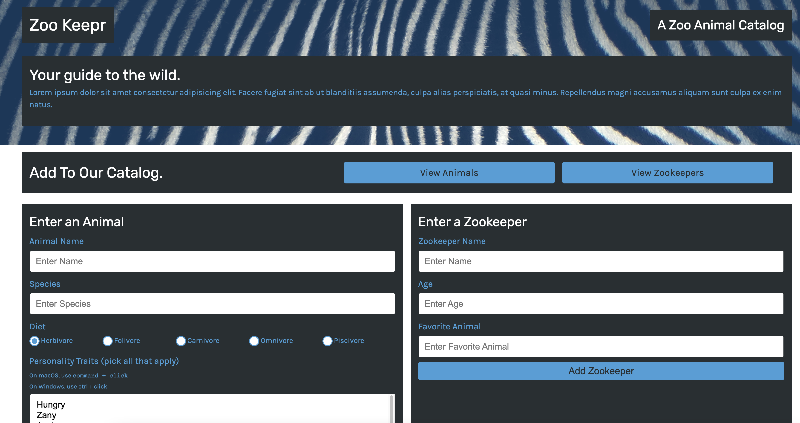

# Zoo Keepr

## Table of Contents

- [Description](#description)
- [Usage](#usage)
- [Application](#application)
- [Questions](#questions)

## Description

This app is a web server using the Express.js framework and a front-end application called Zoo Keepr, deployed in Heroku. This app was created by following the steps of a course module.

## Usage

Open website and enter an animal, and/or enter a zookeeper. View a catalog of all of the zookeepers and animals by clicking on their respective buttons.

## Application

[Link to Deployed Application](https://module11-zookeepr.herokuapp.com/)

## Questions?

For any questions, please email gilinamcbride@gmail.com, or visit any other projects on [Github](github.com/gilinamcbride).
